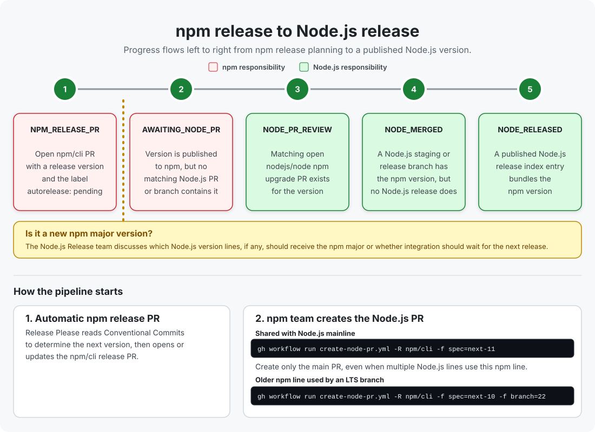

# Node.js ↔ npm version map

A dependency-free GitHub Pages dashboard mapping every published Node.js release to its bundled npm version. A daily GitHub Actions workflow builds a static snapshot from:

- [Node.js release index](https://nodejs.org/dist/index.json)
- [Official Node.js release schedule](https://github.com/nodejs/Release/blob/main/schedule.json)
- [npm packument](https://registry.npmjs.org/npm)
- open [npm CLI release pull requests](https://github.com/npm/cli/pulls)
- npm versions in maintained `nodejs/node` release, staging, and `main` branches

The dashboard hides end-of-life Node.js lines by default, lists pending npm releases and backports before publication, distinguishes open npm update PRs and updates already merged into Node.js branches from updates that still need integration, and highlights newer npm majors that have not shipped in a published Node.js release.

## npm release pipeline



An npm version moves through five detectable states from left to right. Once the Node.js PR is merged, staging and release branches are treated as the same `NODE_MERGED` state until a published Node.js version bundles the npm version.
The first two stages are owned by the npm team; the remaining stages are owned by the Node.js team.

### How the pipeline starts

1. [Release Please](https://github.com/googleapis/release-please) automatically opens or updates the npm release PR. It uses [Conventional Commits](https://www.conventionalcommits.org/) to determine the next version and generate the release notes.

   > **Major-version decision:** For a new npm major, the Node.js Release team discusses which Node.js release lines, if any, should receive it, or whether integration should wait for the next Node.js release.

2. After the npm version is released, someone from the npm team manually runs the [`create-node-pr.yml`](https://github.com/npm/cli/actions/workflows/create-node-pr.yml) workflow to open or update the corresponding `nodejs/node` PR:

   ```sh
   gh workflow run create-node-pr.yml -R npm/cli -f spec=next-11
   ```

   When the npm version is shared by Node.js mainline and multiple maintained Node.js lines, only create the PR targeting `main`.

3. When an older npm version is used by an LTS Node.js branch that is not mainline, create a separate PR targeting that Node.js release branch:

   ```sh
   gh workflow run create-node-pr.yml -R npm/cli -f spec=next-10 -f branch=22
   ```

Run `node scripts/generate-data.mjs` to build the self-contained `dist/index.html` dashboard and reusable `dist/data/versions.json` snapshot. The generated HTML embeds its data, styles, and JavaScript, so it can be opened directly without a web server. The entire `dist/` directory is generated and intentionally excluded from Git.

## Deploy

1. Push the repository to GitHub with `main` as the default branch.
2. In **Settings → Pages → Build and deployment**, choose **GitHub Actions**.
3. Run **Deploy daily version map** or wait for the next push/scheduled run.

The workflow deploys on every push to `main`, on manual dispatch, and daily at 06:17 UTC.

Trigger an immediate dashboard refresh and deployment:

```sh
gh workflow run pages.yml -R reggi/node-npm-release-map
```
